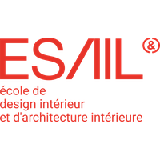
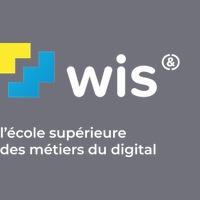

<div align="center">
  
  <h1>@studentsphere/ots-provider-wigor</h1>
</div>

<div align="center">
  
  <b>Wigor Service E-EDT</b>
  <p>Wigor is the central ERP system for the C&D and IGENIA Education groups, providing integrated management for the schools listed below.</p>
</div>

Wigor Timetable implementation of an Open Timetable Scraper (OTS) provider

> [!CAUTION]
> **LEGAL DISCLAIMER AND LIMITATION OF LIABILITY**
>
> This project, `@studentsphere/ots-provider-wigor`, is an independent open-source tool. It is **not affiliated with, authorized, maintained, sponsored, or endorsed** by the **[Compétences & Développement (C&D)](https://www.competences-developpement.com)** group, **[IGENSIA Education](https://www.igensia-education.fr)**, or the developers of the **[WigorServices](http://wigorservices.net)** platform.
>
> 1. **Intellectual Property:** All trademarks, logos, and brand names are the property of their respective owners. Their mention here is strictly for identification and compatibility purposes and does not imply any association.
> 2. **Responsible Use:** This tool is provided for educational purposes and to facilitate interoperability. It is the end-user's sole responsibility to ensure that using this scraper complies with their institution's Terms of Service (ToS) and local laws regarding automated data access.
> 3. **No Warranty:** The software is provided "as is", without warranty of any kind. The developer assumes no liability for account suspensions, access blocks, or any legal actions taken by the aforementioned groups resulting from the use of this tool.
> 4. **Service Changes:** Since this tool relies on parsing third-party web pages, functionality may break at any time due to updates on the official WigorServices portals.
>
> **By using this package, you acknowledge and agree to these terms in full.**

This provider specializes in extracting and retrieving data from Wigor-based school portals. It automates the connection and parsing of Wigor timetables, converting raw HTML into a clean, standardized format for the Open Timetable Scrapper ecosystem.

## Installation

```bash
npm install @studentsphere/ots-provider-wigor
```

## Features

- **Wigor System Support**: Specifically designed to interface with Wigor-based timetable portals.
- **CAS Authentication**: Automatically handles Central Authentication Service (CAS) login flows.
- **Multi-School Support**: Built-in support for numerous schools and campuses using the Wigor system.
- **Standardized Output**: Converts complex HTML timetable grids into clean, standardized `Course` objects defined by `@studentsphere/ots-core`.

## Usage

To use the Wigor provider in your application, instantiate the `WigorProvider` class. You can then validate user credentials and fetch their schedule.

```typescript
import { WigorProvider } from "@studentsphere/ots-provider-wigor";

const provider = new WigorProvider();

// 1. Validate credentials
const isValid = await provider.validateCredentials({
  identifier: "student_username",
  password: "student_password"
});

if (isValid) {
  // 2. Fetch the schedule for a specific date range
  const fromDate = new Date("2026-10-01T00:00:00Z");
  const toDate = new Date("2026-10-31T23:59:59Z");

  const courses = await provider.getSchedule(
    {
      identifier: "student_username",
      password: "student_password"
    },
    fromDate,
    toDate
  );

  console.log(courses);
}
```

## Supported C&D and IGENSIA Education Schools

| Logo                                                                         | Institution                |
| ---------------------------------------------------------------------------- | -------------------------- |
|                          | 3A                         |
|                        | EPSI                       |
|                       | ESAIL                      |
|                         | ICL                        |
|       | IDRAC Business School      |
|                        | IEFT                       |
|                         | IET                        |
|                        | IFAG                       |
|                       | IGEFI                      |
|                     | IHEDREA                    |
|                       | ILERI                      |
|                  | SUP' DE COM                |
|                  | VIVA MUNDI                 |
|                         | WIS                        |
|   | American Business College  |
|                        | ESAM                       |
|         | ICD BUSINESS SCHOOL        |
|                  | IGENSIA RH                 |
|                        | IMIS                       |
|                        | IMSI                       |
|                         | IPI                        |
|                       | ISCPA                      |
|                        | ISMM                       |
|                        | CNVA                       |
|  | Business Science Institute |
|                         | ECM                        |
|                         | EMI                        |
|                         | ESA                        |

## Dependencies

This provider relies on several key packages to function:
- `axios` & `axios-cookiejar-support`: For handling HTTP requests and maintaining session cookies.
- `cheerio`: For parsing and extracting data from the Wigor HTML timetable grids.
- `tough-cookie`: For robust cookie management during the authentication flow.
- `p-limit`: For managing concurrency when fetching multiple weeks of schedule data.

## License

MIT
